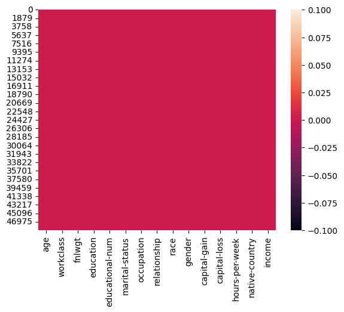
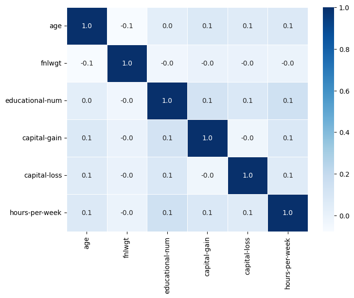
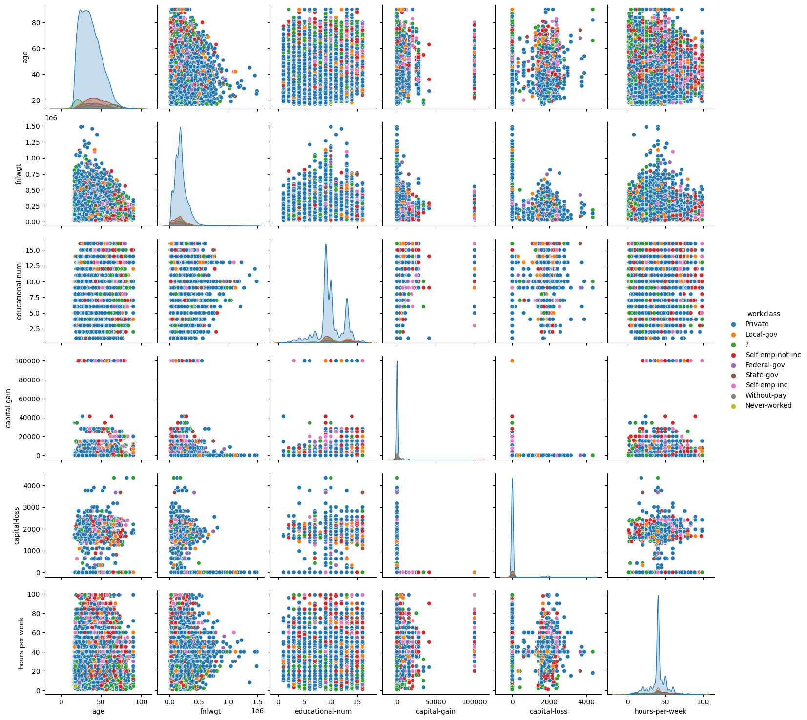
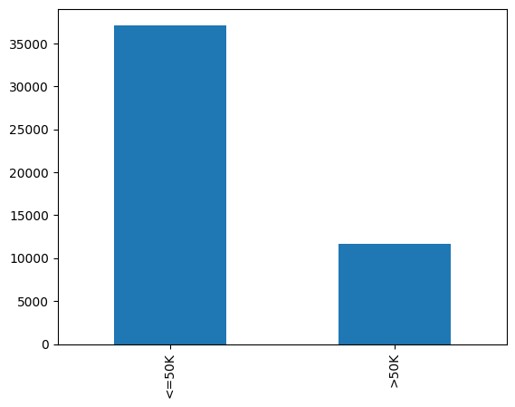
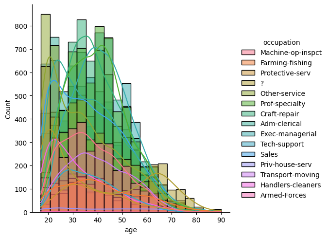
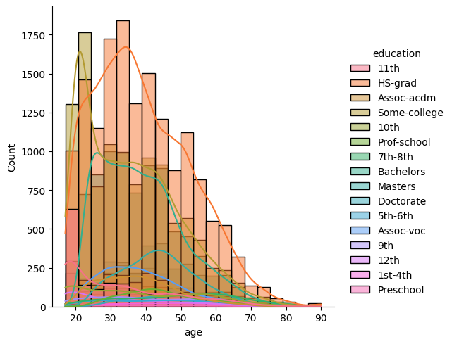
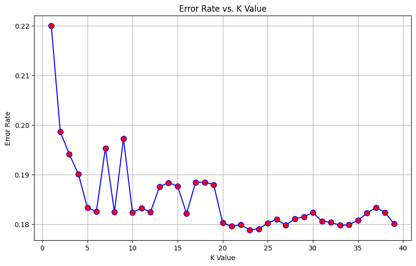
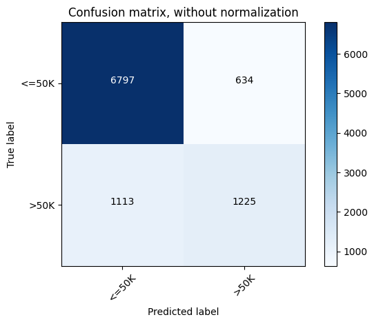
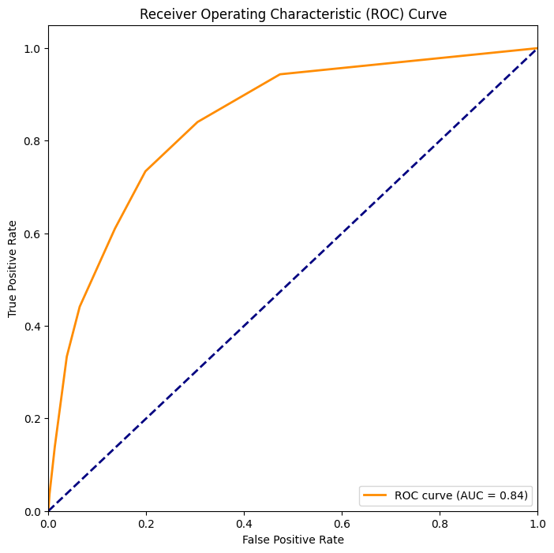
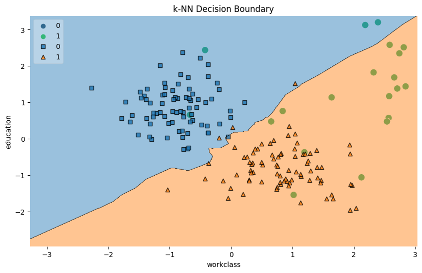

# Laporan Proyek Machine Learning
### Nama : Endah Anisah Fauziyah
### Nim : 211351050
### Kelas : TIF Pagi B

## Domain Proyek
"Adult Income" atau "Adult Income Dataset" adalah sebuah dataset yang umumnya digunakan dalam konteks pembelajaran mesin dan analisis data. Dataset ini berisi informasi mengenai berbagai atribut atau fitur yang terkait dengan individu dewasa, seperti usia, pekerjaan, pendidikan, status pernikahan, dll., dengan tujuan untuk memprediksi apakah pendapatan individu tersebut melebihi atau tidak melebihi ambang batas tertentu (misalnya, $50,000 per tahun).

Tujuan dari membuat aplikasi prediksi pendapatan orang dewasa berbasis dataset ini adalah untuk memahami dan memprediksi faktor-faktor apa yang berkontribusi terhadap tinggi rendahnya pendapatan seseorang. Dengan menganalisis dataset ini dan membangun model prediksi, dapat diidentifikasi pola dan hubungan antara atribut-atribut tertentu dengan tingkat pendapatan, yang dapat digunakan untuk mengambil keputusan atau membuat prediksi untuk data baru.

Pada hasil dari proyek pembuatan aplikasi "Prediksi Pendapatan Orang Dewasa" menggunakan Streamlit. Domain proyek ini terkait dengan analisis ekonomi dan sosial, khususnya dalam memprediksi pendapatan orang dewasa. Aplikasi ini menggunakan metode K-Nearest Neighbors (KNN) untuk melakukan prediksi pendapatan berdasarkan beberapa fitur atau atribut tertentu. 

## Business Understanding

### Problem Statements
Banyak organisasi dan pemerintah membutuhkan pemahaman yang mendalam tentang distribusi pendapatan di dalam populasi untuk merancang kebijakan sosial dan ekonomi yang efektif. Oleh karena itu, diperlukan suatu aplikasi prediksi pendapatan orang dewasa yang dapat memberikan wawasan dan memfasilitasi pengambilan keputusan yang tepat. Beberapa tantangan dari pembuatan aplikasi prediksi pendapatan orang dewasa:

- Kurangnya pemahaman tentang faktor-faktor apa yang mempengaruhi tingkat pendapatan seseorang menyebabkan ketidakpastian dalam perencanaan kebijakan dan program sosial.
- Aplikasi harus mampu mengklasifikasikan individu ke dalam kelompok pendapatan yang relevan, membantu dalam mengidentifikasi kelompok yang memerlukan dukungan sosial atau kebijakan khusus.
- Organisasi dan individu memerlukan informasi yang akurat dan terkini untuk mengambil keputusan yang berhubungan dengan perencanaan keuangan, investasi, dan kebijakan sosial.
- Diperlukan model prediksi yang handal dan mudah diakses, sehingga pengguna dapat dengan cepat memperoleh hasil dan interpretasi yang relevan.

Aplikasi prediksi pendapatan orang dewasa dengan menggunakan metode K-Nearest Neighbors (KNN) dirancang untuk mengatasi tantangan ini, memberikan solusi yang efektif untuk pemodelan prediksi yang akurat dan berbasis data.

### Goals
- Adanya aplikasi ini adalah mengembangkan model prediksi pendapatan yang dapat memberikan hasil yang akurat dan dapat diandalkan. Model ini menggunakan algoritma K-Nearest Neighbors (KNN) untuk mengklasifikasikan pendapatan orang dewasa.
- Menyediakan wawasan mendalam tentang faktor-faktor apa yang paling berpengaruh terhadap tingkat pendapatan orang dewasa. Hal ini bertujuan untuk mengurangi ketidakpastian dalam merancang kebijakan sosial dan ekonomi.

### Solution statements
- mengembangkan model machine learning menggunakan algoritma K-Nearest Neighbors (KNN) untuk memprediksi pendapatan orang dewasa. KNN dipilih karena keunggulannya dalam mengatasi masalah klasifikasi berdasarkan data numerik.
- Solusi ini mencakup integrasi fitur visualisasi, seperti Confusion Matrix, Decision Regions, dan Elbow Method, untuk memberikan pemahaman yang lebih baik terhadap hasil prediksi dan keputusan model.
- Fokus pada optimalisasi antarmuka pengguna, termasuk peningkatan tata letak, kejelasan informasi, dan kemudahan navigasi. Hal ini bertujuan untuk memberikan pengalaman pengguna yang lebih baik.

## Data Understanding
Pada hasil proyek ini saya menggunakan dataset yang tersedia di kaggle.com yaitu "Adult Income" dataset ini berisi tentang berisi informasi tentang berbagai atribut atau fitur yang dapat digunakan untuk memprediksi apakah seseorang memiliki pendapatan di atas atau di bawah batas tertentu (misalnya, $50,000 per tahun). Data ini berjumlah 14 Atribut tetapi disini saya hanya menggunakan 8 atribut yaitu education,occupation,gender,marital-status,native-country,race,relationship, dan workclass.<br>
[Adult Income ataset](https://www.kaggle.com/datasets/wenruliu/adult-income-dataset)  

### Variabel-variabel pada Adult Income dataset adalah sebagai berikut:
- age             : Usia orang dewasa.
- workclass       : Kelas pekerjaan atau jenis pekerjaan yang dijalani.
- fnlwgt          : Final weight, bobot akhir yang digunakan dalam proses survey sampling untuk menciptakan representasi populasi.
- education       : Tingkat pendidikan yang telah dicapai.
- educational-num : Jumlah tahun pendidikan yang telah ditempuh.
- marital-status  : Status pernikahan seseorang.
- occupation      : Jenis pekerjaan atau profesi yang dijalani.
- relationship    : Hubungan keluarga atau status hubungan sosial.
- race            : Ras atau etnis.
- gender          : Jenis kelamin.
- capital-gain    : Keuntungan finansial atau modal.
- capital-loss    : Kerugian finansial atau modal.
- hours-per-week  : Jumlah jam kerja per minggu.
- native-country  : Negara asal atau negara tempat seseorang tinggal atau berasal.


## Data Preparation
Aplikasi prediksi pendapatan orang dewasa dengan menggunakan Streamlit melibatkan serangkaian langkah untuk mempersiapkan dataset adult income agar dapat digunakan oleh model K-Nearest Neighbors (KNN). Berikut adalah langkah-langkah Data Preparation tersebut:

- Loading Dataset:
Dataset adult income diimpor ke dalam aplikasi menggunakan fungsi load_data.
Dataset ini mencakup berbagai variabel seperti usia, kelas pekerjaan, tingkat pendidikan, status pernikahan, dan lainnya.

- Training Model:
Model KNN dilatih menggunakan fungsi train_model dengan fitur-fitur yang relevan sebagai variabel independen (x) dan variabel target (y).

- Visualization Data:
Sebagian dari dataset digunakan untuk visualisasi hasil model, seperti Confusion Matrix, Decision Regions, dan Elbow Method.
Visualisasi ini membantu pemahaman kinerja model dalam memprediksi pendapatan.

- K-Nearest Neighbors (KNN):
Menggunakan KNN untuk membuat visualisasi decision boundary pada dataset.
KNN digunakan untuk menunjukkan batas keputusan dalam memisahkan kategori pendapatan.
Streamlit Interface:

Menyiapkan antarmuka Streamlit untuk menampilkan hasil visualisasi dan evaluasi model.
Menampilkan Confusion Matrix, Decision Regions, dan Elbow Method untuk memberikan wawasan lebih lanjut kepada pengguna.
Data Preparation ini menciptakan dasar yang baik untuk memanfaatkan model KNN dalam memprediksi pendapatan orang dewasa melalui antarmuka aplikasi yang ramah pengguna dengan menggunakan Streamlit

## Data Discovery And Profiling

**Import Dataset Kaggle**<br>
Pertama-tama Menggunakan modul Colab untuk mengunggah file. Dalam hal ini, file yang diunggah adalah kaggle.json, yang berisi kunci API Kaggle.
```bash
from google.colab import files
files.upload()
```
Membuat direktori, Menyalin file kaggle.json ke direktori kaggle, Memberikan izin hanya untuk membaca dan menulis kepada pemilik file kaggle.json, Menampilkan isi dari direktori .kaggle untuk memastikan bahwa file kaggle.json telah disalin dengan benar.
```bash
!mkdir -p ~/.kaggle
!cp kaggle.json ~/.kaggle/
!chmod 600 ~/.kaggle/kaggle.json
!ls ~/.kaggle
```
Mengunduh dataset "Adult Income" dari Kaggle menggunakan kunci API Kaggle.
```bash
!kaggle datasets download -d wenruliu/adult-income-dataset
```
Membuat direktori baru untuk menyimpan dataset yang diunduh, Mengekstrak isi file zip yang diunduh ke dalam direktori adult-income-dataset, Menampilkan isi dari direktori adult-income-dataset untuk memeriksa dataset yang telah diekstrak.
```bash
!mkdir adult-income-dataset
!unzip adult-income-dataset.zip -d adult-income-dataset
!ls adult-income-dataset
```

**Import Library yang dibutuhkan**<br>

```bash
import numpy as np
import pandas as pd
import matplotlib.pyplot as plt
import seaborn as sns
import pickle

from sklearn.metrics import confusion_matrix, accuracy_score
from sklearn.neighbors import KNeighborsClassifier
from sklearn.model_selection import train_test_split
from sklearn.datasets import make_blobs
from sklearn.metrics import classification_report
from sklearn.metrics import roc_curve, auc
from sklearn.model_selection import cross_val_score
from mlxtend.plotting import plot_decision_regions
from sklearn.preprocessing import StandardScaler
from sklearn.preprocessing import LabelEncoder
l1=LabelEncoder()

import itertools
import random
import statistics
import warnings
warnings.filterwarnings('ignore')
%matplotlib inline
```

- **Data Discovery**<br>
- Membaca data dari file CSV:<br>
```bash
df = pd.read_csv('adult-income-dataset/adult.csv')
```
- Melakukan ringkasan informasi tentang DataFrame, termasuk jumlah baris, jumlah kolom, tipe data, dan jumlah nilai non-null.
- Menampilkan sejumlah baris pertama dari DataFrame.
- Menggunakan metode drop untuk menghapus kolom 'capital-gain' dan 'capital-loss'. Parameter axis=1 menunjukkan bahwa penghapusan dilakukan pada kolom, bukan baris.

- Mengatasi missing values:<br>
```bash
numerical = []
catgols = []

for col in df.columns:
  if df[col].dtype=="float64":
    numerical.append(col)
  else:
    catgols.append(col)

for col in df.columns:
  if col in numerical:
    df[col].fillna(df[col].median(), inplace=True)
  else:
    df[col].fillna(df[col].mode()[0], inplace=True)
```

jika 'income' adalah kolom yang berisi kategori seperti '<=50K' dan '>50K', pemanggilan value_counts() akan menghasilkan suatu objek yang menunjukkan berapa banyak data yang memiliki nilai '<=50K' dan '>50K'. Artinya, dalam kolom 'income', terdapat 37,155 data dengan nilai '<=50K' dan 11,678 data dengan nilai '>50K'. 
```bash
df['income'].value_counts()
```

Membagi kolom-kolom dalam df menjadi dua jenis, yaitu: independent columns (kolom independen) dan dependent column (kolom dependen).
```bash
ind_col = [col for col in df.columns if col != ['income']] 
dep_col = ['income']
```

- **Exploratory Data Analysis (EDA)**<br>
Berikut adalah beberapa hasil Visualisasi Exploratory Data Analysis (EDA) :<br>
<br>
Membuat peta panas (heatmap) untuk menunjukkan keberadaan nilai null (missing values) dalam DataFrame df. Setiap sel dengan nilai null akan ditandai dengan warna yang berbeda pada peta panas.

ika heatmap menunjukkan warna yang senada, seperti pink, pada seluruh peta, maka hal ini menunjukkan bahwa terdapat korelasi yang tinggi atau sempurna antara variabel-variabel yang diamati. Dengan kata lain, nilai-nilai dari variabel-variabel tersebut cenderung berubah bersamaan satu sama lain. Korelasi positif tinggi dapat diindikasikan oleh warna yang mendekati atau mencapai intensitas maksimum pada peta, sedangkan korelasi negatif tinggi dapat diindikasikan oleh warna yang mendekati atau mencapai intensitas minimum.<br>

Tetapi jangan cepat mengambil kesimpulan kausalitas hanya karena dua variabel berkorelasi tinggi, itu belum tentu berarti satu variabel menyebabkan yang lain. Korelasi dapat memberikan petunjuk untuk hubungan antarvariabel, tetapi analisis lebih lanjut mungkin diperlukan untuk memahami sebab-akibat antarvariabel tersebut.<hr>

<br>
Membuat subplot korelasi untuk menunjukkan korelasi antara setiap pasangan variabel dalam DataFrame df. Nilai korelasi ditampilkan di setiap sel subplot dengan notasi angka dan warna yang mengindikasikan tingkat korelasi.<br>

## Warna pada Heatmap:
- Jika warna mendekati biru tua, itu menunjukkan tingkat korelasi positif yang kuat antar fitur.
- Jika warna mendekati biru muda atau putih, itu menunjukkan tingkat korelasi yang rendah atau mendekati nol.<br>

## Nilai Anotasi (Annotated Values):
- Jika nilai anotasi (ditampilkan pada setiap sel heatmap) mendekati 1, itu menunjukkan korelasi positif yang sangat kuat.
- Jika nilai mendekati -1, itu menunjukkan korelasi negatif yang sangat kuat.
- Jika nilai mendekati 0, itu menunjukkan korelasi yang rendah atau tidak ada korelasi.<hr>

<br>
Membuat matriks scatter plot dari pasangan variabel dalam DataFrame df. Scatter plot ini memungkinkan kita untuk melihat distribusi dan hubungan antara pasangan variabel. Argumen hue='workclass' memberikan warna berbeda pada plot untuk setiap kategori dalam kolom 'workclass', membantu melihat pola berdasarkan kelas.<br>

Pairplot digunakan untuk memberikan pemahaman visual tentang hubungan antar fitur dan distribusi variabel dalam dataset.
Warna pada scatter plots memberikan informasi tentang kategori 'workclass' dalam hal ini dan membantu melihat bagaimana variabel berbeda berinteraksi untuk setiap kategori.<br>

- Jika scatter plots menunjukkan pola garis atau pola tertentu, itu menunjukkan hubungan linier antara dua variabel.
- Jika scatter plots tersebar secara merata dan tidak menunjukkan pola, itu menunjukkan korelasi rendah atau tidak ada korelasi antara dua variabel.<hr>

<br>
Membuat diagram batang (bar chart) yang menunjukkan jumlah pengamatan untuk setiap nilai unik dalam kolom 'income'. Ini memberikan gambaran visual tentang distribusi kelas dalam dataset.<hr>

Jika batang <=50K lebih tinggi dari batang >50K, itu berarti jumlah individu atau pengamatan yang memiliki pendapatan kurang dari atau sama dengan $50,000 lebih banyak dibandingkan dengan individu yang memiliki pendapatan di atas $50,000. Jadi, dari hasil yang bisa kita lihat bahwa batang <=50K lebih tinggi, itu berarti menunjukkan bahwa mayoritas individu dalam dataset memiliki pendapatan kurang dari atau sama dengan $50,000.<hr>

<br>
Membuat histogram (displot) untuk variabel 'age' dalam DataFrame df. Histogram menunjukkan distribusi frekuensi dari nilai-nilai 'age', dan argumen hue='occupation' memberikan warna berbeda pada histogram untuk setiap kategori dalam kolom 'occupation'. Tujuan dari plot ini, yaitu:<br>

- Memahami distribusi umur dalam dataset, dengan fokus pada perbedaan distribusi berdasarkan pekerjaan (occupation).
- Mengetahui apakah ada perbedaan pola umur antara berbagai kategori pekerjaan.<br>

Setiap batang pada plot mewakili rentang umur tertentu (interval bins) dengan tinggi batang menunjukkan frekuensi kemunculan umur dalam rentang tersebut. Tingginya batang menunjukkan bahwa terdapat frekuensi kemunculan umur yang lebih tinggi dalam kategori 'other_service'.<br>

Puncak atau bagian paling tinggi dari batang menunjukkan di mana nilai umur paling sering muncul.
Jika 'other_service' memiliki batang lebih tinggi, hal itu menunjukkan bahwa terdapat kelompok umur tertentu yang lebih umum atau mendominasi dalam kategori 'other_service'.<br>

Perbandingan tinggi batang antar kategori pekerjaan (occupation) dapat memberikan wawasan tentang distribusi umur yang berbeda-beda di antara berbagai pekerjaan.<hr>

<br>
Membuat histogram (displot) untuk variabel 'age' dalam DataFrame df. Histogram menunjukkan distribusi frekuensi dari nilai-nilai 'age', dan argumen hue='education' memberikan warna berbeda pada histogram untuk setiap kategori dalam kolom 'education'.<br>

Tingginya batang menunjukkan bahwa terdapat frekuensi kemunculan umur yang lebih tinggi dalam kategori 'HS-grad'. Jika 'HS-grad' memiliki batang lebih tinggi, hal itu menunjukkan bahwa terdapat kelompok umur tertentu yang lebih umum atau mendominasi dalam kategori 'HS-grad'. Perbandingan tinggi batang antar kategori pendidikan (education) dapat memberikan wawasan tentang distribusi umur yang berbeda-beda di antara berbagai tingkat pendidikan.<br>

Dari plot ini, dapat diinterpretasikan bahwa dalam kategori 'HS-grad', terdapat kelompok umur yang lebih tinggi atau lebih dominan dibandingkan dengan kategori pendidikan lainnya.<hr>

- **Data Preprocessing**<br>
- Mengubah Data Kategorikal<br>
Dengan melakukan ini untuk setiap kolom kategorikal, kita mengonversi nilai-nilai kategorikal menjadi bentuk numerik sehingga dapat digunakan oleh model pembelajaran mesin yang umumnya memerlukan input numerik.
```bash
le = LabelEncoder()

for col in catgols:
  df[col] = le.fit_transform(df[col])
```

mengonversi nilai dalam kolom target 'income' yang bersifat kategorikal menjadi bentuk numerik.
```bash 
df['income'] = le.fit_transform(df['income'])
```

Menyimpan kembali file csv yang sudah diubah datanya
```bash
df.to_csv('adult-income.csv')
```
- Seleksi Fitur <br>
dilakukan seleksi fitur dengan memilih kolom-kolom tertentu dari DataFrame df untuk digunakan sebagai fitur (x). Kolom-kolom tersebut mencakup 'education', 'occupation', 'native-country', 'workclass', 'race', 'marital-status', 'gender', dan 'relationship'. Selain itu, kolom 'income' dipilih sebagai variabel target (y).
- Pembagian Dataset:<br>
membagi dataset menjadi dua bagian: satu untuk pelatihan model (X_train dan y_train) dan satu untuk menguji model (X_test dan y_test).
- Standardisasi Fitur:<br>
digunakan untuk menghitung rata-rata dan deviasi standar dari setiap fitur pada data latihan (X_train), serta mengaplikasikan transformasi ke data latihan, digunakan untuk mengaplikasikan transformasi yang sama ke data uji (X_test). Hal ini dilakukan untuk memastikan bahwa skala fitur di data uji sesuai dengan skala fitur di data latihan.

- **Modeling**
Modeling dengan metode K-Nearest Neighbors (KNN) adalah proses membangun model prediktif menggunakan algoritma KNN.
- **Training the model**<br>
Melatih model KNN dengan menggunakan data pelatihan (X_train, y_train). Model ini menggunakan 8 tetangga terdekat, menggunakan metrik Minkowski, dan p=2 menunjukkan penggunaan Euclidean distance.
```bash
classifier= KNeighborsClassifier(n_neighbors=8, metric='minkowski', p=2 )
classifier.fit(X_train, y_train)
```

- **Evaluasi Model dan Prediksi**<br>
Mengukur akurasi model KNN pada data pengujian (X_test, y_test) dan mencetak hasilnya.
```bash
score = classifier.score(X_test, y_test)
print('Model accuracy (KNN):', score)
```

Memberikan prediksi pendapatan orang dewasa untuk data input baru yang diberikan.
```bash
input_data = np.array([[1,5,0,10,0,1,0,3]])

predict = classifier.predict(input_data)
print('adult income :', predict)
```

- **Cross Validation**<br>
Melakukan validasi silang (cross-validation) untuk mencari jumlah tetangga optimal (k) dengan menghitung akurasi rata-rata menggunakan 10 lipatan.
```bash
accuracy_rate = []

for i in range(1, 40):

    knn = KNeighborsClassifier(n_neighbors=i)
    score = cross_val_score(knn, x, y, cv=10)
    accuracy_rate.append(score.mean())
```

- **Evaluasi Model dengan Cross Validation**<br>
Melakukan validasi silang untuk model KNN dengan k=8 dan mencetak skor validasi silang.
```bash
knn = KNeighborsClassifier(n_neighbors = 8)
scores = cross_val_score(knn, x, y, cv=5, scoring='accuracy')
print(scores)
```

Mencetak akurasi rata-rata dari model KNN menggunakan cross-validation. Dan muncul hasil accuracy of model using cross validation 0.8150361558386946
```bash
 print("accuracy of model using cross validation",scores.mean())
```

- **Error Rate vs. K Value**<br>
Plotting grafik Error Rate vs. K Value untuk membantu memilih nilai k terbaik.
```bash
error_rate = []
for i in range(1, 40):
    knn = KNeighborsClassifier(n_neighbors=i)
    knn.fit(X_train, y_train)
    pred_i = knn.predict(X_test)
    error_rate.append(np.mean(pred_i != y_test))

plt.figure(figsize=(10, 6))
plt.plot(range(1, 40), error_rate, color='blue', linestyle='solid', marker='o',
         markerfacecolor='red', markersize=8)
plt.title('Error Rate vs. K Value')
plt.xlabel('K Value')
plt.ylabel('Error Rate')
plt.grid(True)
plt.show()
```
 

- **Best K based on Error Rate**<br>
Mencari nilai k terbaik berdasarkan Error Rate yang dihitung. Dan hasil menunjukkan best k = 23
```bash
error_rate = []
k_values = list(range(1, 40))

for k in k_values:
    knn = KNeighborsClassifier(n_neighbors=k)
    knn.fit(X_train, y_train)
    y_pred = knn.predict(X_test)
    error_rate.append(np.mean(y_pred != y_test))

best_k_error_rate = k_values[np.argmin(error_rate)]
print("Best k based on Error Rate:", best_k_error_rate)
```

- **Confusion Matrix and Classification Report**<br>
Membuat model KNN terbaik berdasarkan nilai k terbaik yang ditemukan sebelumnya dan mengevaluasi kinerjanya menggunakan confusion matrix dan classification report.
```bash
# Buat model KNN dengan nilai k terbaik
best_knn = KNeighborsClassifier(n_neighbors=23)
best_knn.fit(X_train, y_train)
y_pred_best_knn = best_knn.predict(X_test)

# Hitung confusion matrix
cm_best_knn = confusion_matrix(y_test, y_pred_best_knn)

# Cetak confusion matrix
print("Confusion Matrix:")
print(cm_best_knn)

# Evaluasi tambahan (misalnya, classification report)
classification_rep_best_knn = classification_report(y_test, y_pred_best_knn)
print("\nClassification Report:")
print(classification_rep_best_knn)
```

Plotting confusion matrix yang dinormalisasi untuk memberikan wawasan lebih lanjut tentang performa model KNN.
```bash
# Misalnya, jika nilai k terbaik adalah 23
best_k = 23
knn = KNeighborsClassifier(n_neighbors=best_k)
knn.fit(X_train, y_train)
y_pred_knn = knn.predict(X_test)
cnf_matrix_knn = confusion_matrix(y_test, y_pred_knn)

# Menampilkan confusion matrix
plt.figure()
plot_confusion_matrix(cnf_matrix_knn, income=['<=50K', '>50K'], title='Confusion matrix, without normalization')
plt.show()
```


**Visualisasi Hasil Algoritma**




## Evaluation
Evaluation atau evaluasi pada aplikasi Adult Income dapat melibatkan beberapa aspek untuk mengukur sejauh mana aplikasi tersebut memenuhi tujuan dan memberikan nilai tambah. Berikut beberapa aspek evaluasi yang dapat dipertimbangkan:

**1. Akurasi Prediksi:**<br>
- Evaluasi seberapa baik model K-Nearest Neighbors (KNN) dapat memprediksi pendapatan orang dewasa berdasarkan fitur yang diberikan.
Menggunakan metrik akurasi untuk mengukur sejauh mana prediksi model cocok dengan data aktual.

**2. Confusion Matrix:**<br>
- Mengevaluasi confusion matrix untuk melihat seberapa baik model dapat mengklasifikasikan antara kategori pendapatan yang lebih tinggi dan lebih rendah.
- Memeriksa nilai True Positive, True Negative, False Positive, dan False Negative.
- 
**3. Area Under Curve (AUC) ROC:**<br>
- Melihat performa model dengan menganalisis Area Under Curve dari Receiver Operating Characteristic (ROC).
ROC memberikan wawasan tentang seberapa baik model dapat membedakan antara kelas positif dan negatif.

**4. Cross-Validation Score:**<br>
- Melakukan validasi silang untuk memastikan bahwa model memiliki kinerja yang baik pada berbagai subset data.
Memastikan bahwa model tidak overfitting atau underfitting pada data tertentu.

## Deployment

[Aplikasi Prediksi Pendapatan Orang Dewasa](https://app-adult-income-1050.streamlit.app/)


